# MarketX Database Schema Documentation

## Overview

This document describes the core database schema for the MarketX marketplace platform. The schema follows database normalization principles and includes proper indexing for query optimization.

## Entity Relationship Diagram

```mermaid
erDiagram
    USERS ||--o{ PRODUCTS : "sells"
    USERS ||--o{ ORDERS : "buys"
    USERS ||--o{ ORDERS : "sells"
    USERS ||--o{ TRANSACTIONS : "sends"
    USERS ||--o{ TRANSACTIONS : "receives"
    USERS ||--o{ NOTIFICATIONS : "receives"
    USERS }o--o{ PRODUCTS : "favorites"
    PRODUCTS ||--|| CATEGORIES : "belongs_to"
    PRODUCTS ||--o{ ORDERS : "ordered_in"
    ORDERS ||--o{ TRANSACTIONS : "paid_with"
    
    USERS {
        uuid id PK
        varchar email UK
        varchar password
        varchar first_name
        varchar last_name
        varchar phone_number
        varchar bio
        varchar avatar_url
        varchar stellar_wallet_address UK
        enum role
        enum status
        boolean is_active
        text refresh_token
        varchar language
        decimal seller_rating
        int total_reviews
        int total_sales
        boolean is_verified_seller
        boolean is_email_verified
        boolean is_phone_verified
        timestamp last_login_at
        varchar last_login_ip
        timestamp created_at
        timestamp updated_at
        timestamp deleted_at
    }
    
    PRODUCTS {
        uuid id PK
        varchar title
        text description
        decimal price
        varchar currency
        varchar address
        int category_id FK
        enum status
        enum condition
        int quantity
        int reserved
        int available
        text images
        text tags
        boolean is_active
        boolean is_featured
        boolean is_digital
        int views
        int favorites_count
        decimal average_rating
        int total_reviews
        varchar brand
        varchar model
        timestamp expires_at
        geography location
        boolean share_location
        uuid user_id FK
        timestamp created_at
        timestamp updated_at
        timestamp deleted_at
    }
    
    ORDERS {
        uuid id PK
        decimal total_amount
        decimal tax_amount
        decimal shipping_cost
        decimal discount_amount
        enum status
        enum payment_status
        jsonb items
        varchar shipping_address
        varchar tracking_number
        varchar notes
        varchar cancellation_reason
        timestamp expected_delivery_date
        uuid buyer_id FK
        uuid seller_id FK
        timestamp created_at
        timestamp updated_at
        timestamp confirmed_at
        timestamp shipped_at
        timestamp delivered_at
        timestamp completed_at
        timestamp cancelled_at
        timestamp refunded_at
    }
    
    TRANSACTIONS {
        uuid id PK
        decimal amount
        varchar currency
        text description
        enum status
        enum type
        enum payment_method
        uuid sender_id FK
        uuid receiver_id FK
        uuid order_id FK
        jsonb metadata
        varchar reference_id
        varchar external_reference
        varchar stellar_hash
        decimal fee_amount
        varchar fee_currency
        varchar failure_reason
        timestamp created_at
        timestamp updated_at
        timestamp processed_at
        timestamp completed_at
        timestamp failed_at
        timestamp reversed_at
    }
```

## Core Entities

### 1. Users

The User entity represents all users of the platform including buyers, sellers, admins, and moderators.

**Key Features:**
- UUID primary key for global uniqueness
- Email verification and unique constraints
- Role-based access control (buyer, seller, admin, moderator)
- Account status management (active, inactive, suspended, deleted)
- Seller rating and reputation tracking
- Authentication tokens and session management
- Soft delete capability
- Timestamp tracking (created, updated, deleted)

**Indexes:**
- `IDX_USERS_EMAIL` - Unique email constraint
- `IDX_USERS_CREATED_AT` - Time-based queries
- `IDX_USERS_STATUS` - Status filtering
- `IDX_USERS_ROLE` - Role-based queries

### 2. Products

The Product entity represents items for sale on the marketplace.

**Key Features:**
- Comprehensive product information (title, description, pricing)
- Inventory management (quantity, reserved, available)
- Product categorization and tagging
- Condition ratings (new, like_new, good, fair, poor)
- Featured product flagging
- View counting and popularity metrics
- Rating and review aggregation
- Expiration dates for time-sensitive listings
- Geospatial location data
- Soft delete capability

**Indexes:**
- `IDX_PRODUCTS_TITLE` - Search optimization
- `IDX_PRODUCTS_PRICE` - Price-based filtering
- `IDX_PRODUCTS_USER_ID` - Seller queries
- `IDX_PRODUCTS_CATEGORY_ID` - Category browsing
- `IDX_PRODUCTS_STATUS` - Availability filtering
- Multiple performance indexes for sorting and filtering

### 3. Orders

The Order entity tracks purchase transactions between buyers and sellers.

**Key Features:**
- Detailed financial breakdown (subtotal, tax, shipping, discounts)
- Comprehensive status tracking (pending, confirmed, shipped, delivered, etc.)
- Payment status management
- Flexible JSON item storage for dynamic order contents
- Shipping and delivery tracking
- Cancellation and refund handling
- Timestamp tracking for all order lifecycle events

**Indexes:**
- `IDX_ORDERS_TOTAL_AMOUNT` - Financial reporting
- `IDX_ORDERS_BUYER_ID` - Customer order history
- `IDX_ORDERS_SELLER_ID` - Seller order management
- `IDX_ORDERS_STATUS` - Order processing workflows
- `IDX_ORDERS_PAYMENT_STATUS` - Payment tracking
- `IDX_ORDERS_CREATED_AT` - Time-based analysis

### 4. Transactions

The Transaction entity records all financial movements within the platform.

**Key Features:**
- Support for multiple transaction types (transfer, payment, refund, purchase)
- Various payment methods (Stellar, credit card, bank transfer, wallet)
- Detailed fee tracking and calculation
- Blockchain integration (Stellar hash storage)
- External reference tracking for third-party systems
- Comprehensive status management
- Metadata storage for extensibility

**Indexes:**
- `IDX_TRANSACTIONS_AMOUNT` - Financial analysis
- `IDX_TRANSACTIONS_SENDER_ID` - Sender transaction history
- `IDX_TRANSACTIONS_RECEIVER_ID` - Receiver transaction history
- `IDX_TRANSACTIONS_ORDER_ID` - Order-payment linking
- `IDX_TRANSACTIONS_STATUS` - Transaction monitoring
- `IDX_TRANSACTIONS_TYPE` - Type-based queries
- `IDX_TRANSACTIONS_CREATED_AT` - Time-based reporting

## Relationships

### Direct Relationships

1. **Users → Products**: One-to-many (User sells many Products)
2. **Users → Orders**: One-to-many (User buys/sells many Orders)
3. **Users → Transactions**: One-to-many (User sends/receives many Transactions)
4. **Products → Categories**: Many-to-one (Products belong to Categories)
5. **Orders → Transactions**: One-to-many (Order paid with many Transactions)

### Indirect Relationships

1. **Users ↔ Products**: Many-to-many (Favorites relationship via user_favorites table)
2. **Users → Notifications**: One-to-many (User receives many Notifications)

## Database Design Principles

### Normalization
- **First Normal Form (1NF)**: All attributes contain atomic values
- **Second Normal Form (2NF)**: All non-key attributes fully functionally dependent on primary key
- **Third Normal Form (3NF)**: No transitive dependencies

### Indexing Strategy
- Primary keys automatically indexed
- Foreign keys indexed for join performance
- Frequently queried columns indexed
- Composite indexes for multi-column queries
- Spatial indexes for geolocation data
- Unique constraints where business rules require uniqueness

### Constraints
- **Primary Key Constraints**: UUID generation for global uniqueness
- **Foreign Key Constraints**: Maintain referential integrity
- **Unique Constraints**: Email addresses, wallet addresses
- **Check Constraints**: Data validation rules
- **Not Null Constraints**: Required fields enforced

### Soft Delete Implementation
All major entities include `deleted_at` timestamp columns for soft deletion, allowing:
- Data recovery capabilities
- Audit trail maintenance
- Historical data preservation
- Compliance requirements

## Performance Considerations

### Query Optimization
- Strategic indexing on frequently queried columns
- Composite indexes for common query patterns
- Proper foreign key indexing for joins
- Spatial indexes for location-based queries

### Scalability Features
- UUID primary keys for distributed systems
- Partitioning-ready table structures
- Efficient data types for storage optimization
- Index maintenance considerations

## Migration Strategy

### Forward Migration
The `1706234567890-create-core-entities.ts` migration creates all tables with proper constraints and indexes.

### Rollback Capability
The `1706234567891-rollback-core-entities.ts` migration provides safe rollback functionality:
- Drops foreign key constraints first
- Removes tables in dependency order
- Graceful error handling for missing objects

### Deployment Process
1. Backup existing database
2. Run forward migration
3. Verify schema creation
4. Test application functionality
5. Monitor for issues
6. Ready rollback procedure if needed

## Security Considerations

### Data Protection
- Password hashing with bcrypt (12 rounds)
- Refresh token storage
- Sensitive data exclusion from serialization
- Role-based access control

### Audit Trail
- Creation timestamps for all entities
- Update timestamps for tracking changes
- Deletion timestamps for soft deletes
- User activity logging capabilities

## Future Extensibility

### Extension Points
- JSON/JSONB columns for flexible data storage
- Metadata fields for custom attributes
- Enum extensibility for new statuses/types
- Relationship flexibility for new entities

### Integration Ready
- External reference fields for third-party systems
- Standard currency codes
- Geographic data support
- Blockchain transaction integration

---

*This schema documentation is maintained alongside the codebase and should be updated whenever entity changes occur.*